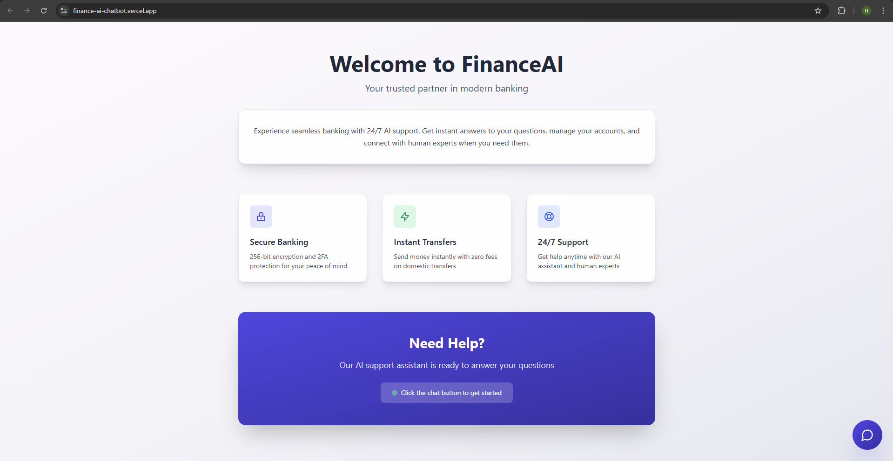
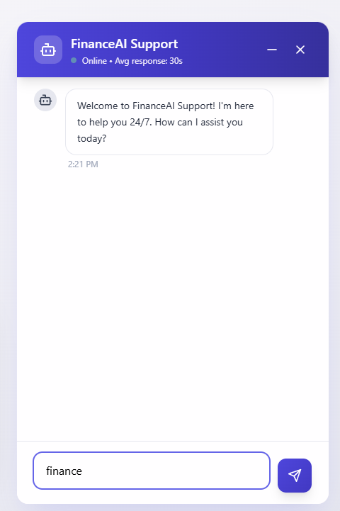
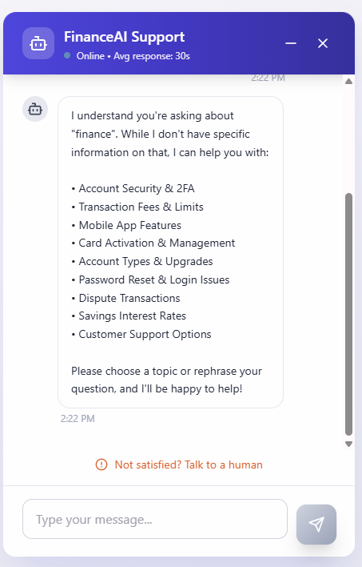
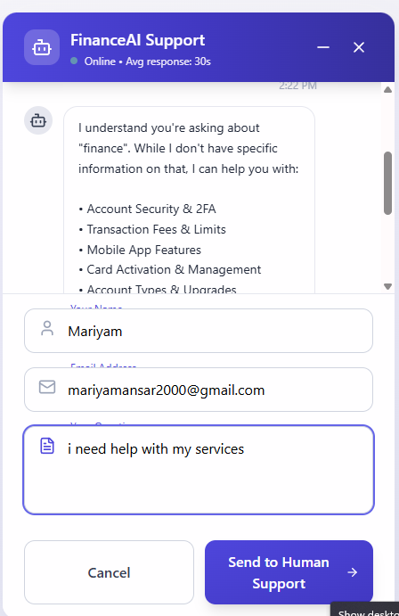
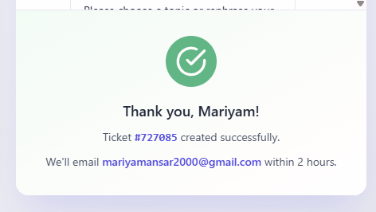
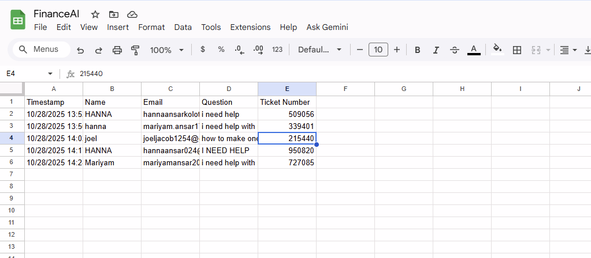

# 💬 FinanceAI Chatbot

A smart and customizable chatbot for handling finance-related queries, ticket management, and automated Google Sheet logging.  
Built with **React + Vite**, integrated with **Google Sheets** for backend logging, and designed for easy deployment.

---

## 🧭 Clone the repository
```bash
git clone https://github.com/Hanna2002-jpg/FinanceAI-Chatbot.git
cd FinanceAI-Chatbot/project
```

## 📦 Install dependencies
```bash
npm install
```

## 🚀 Run the development server
```bash
npm run dev
```

Then open the local server URL shown in your terminal (usually http://localhost:5173).

---

## 🔗 Google Sheets Integration

This chatbot uses **Google Sheets** as a backend log for form submissions and chat history.

### Steps:

1. Create a Google Sheet and copy its ID from the URL:  
   `https://docs.google.com/spreadsheets/d/<YOUR_SHEET_ID>/edit`

2. Add the Sheet ID inside your integration script or `.env` file like this:  
   ```
   VITE_GOOGLE_SHEET_ID=YOUR_SHEET_ID
   ```

3. Make sure the Google Apps Script linked to your Sheet has permissions to receive and log data via a web app URL.

---

## 🖼️ Screenshots

### 🏠 Home


### 💬 Chat Interface


### 🤖 AI Reply


### 📄 Handoff Form


### 🎟️ Ticket Confirmation


### 📊 Google Sheet Integration


---

## 🌟 Future Enhancements

- 🔐 Authentication for user-based logs  
- 🤖 Integration with real AI APIs (OpenAI, Gemini, etc.)  
- 📱 Deployable version for mobile and desktop  

---

## 💛 Contribution

Pull requests are welcome!  
For major changes, please open an issue first to discuss what you’d like to modify.

---

## 📜 License

This project is licensed under the **MIT License**.  
Feel free to use and modify it for your own projects.
